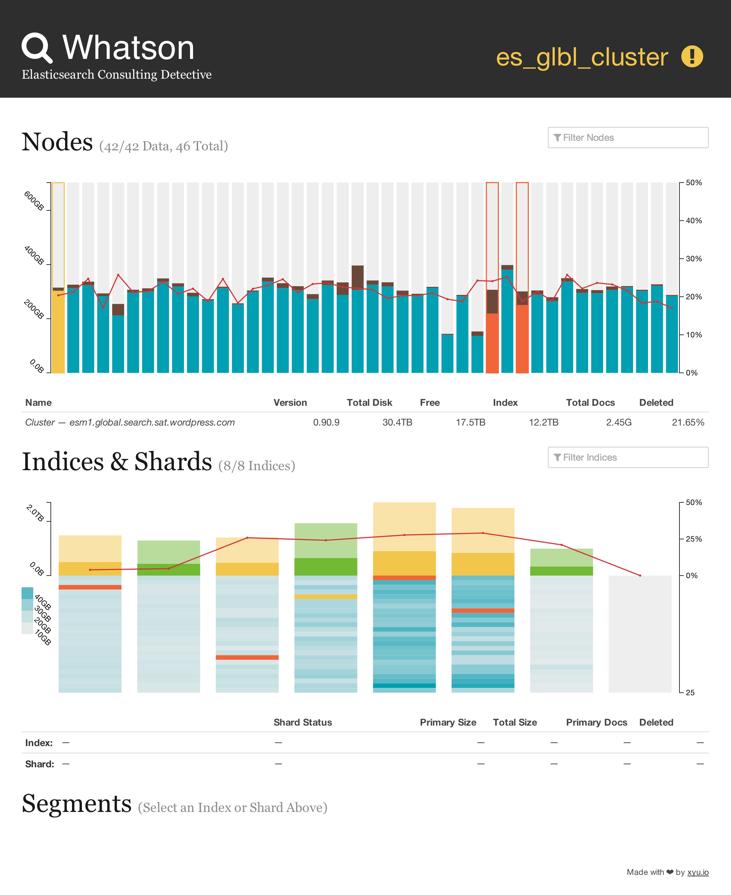
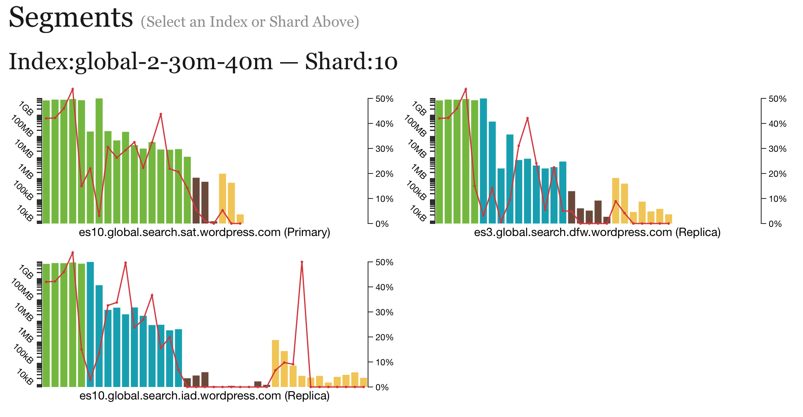

Whatson — ES Consulting Detective
=================================

Whatson is an [elasticsearch](http://elasticsearch.org/) plugin to visualize the state of a cluster. It's inpired by other excellent plugins:

* [ES Head](https://github.com/mobz/elasticsearch-head)
* [Bigdesk](https://github.com/lukas-vlcek/bigdesk)
* [SegmentSpy](https://github.com/polyfractal/elasticsearch-segmentspy)

And designed to give a more compact view of key cluster stats especially useful for large clusters with lots of nodes or lots of indices.

Installation
------------

To install Whatson run the Elasticsearch plugin installer on any node:

    bin/plugin -install xyu/elasticsearch-whatson

Access the plugin by going to the Whatson plugin site. (E.g. http://localhost:9200/_plugin/whatson/)

Whatson will automatically connects to the host the plugin is running on with a refresh interval of 5 seconds. To connect to a different cluster or to use another refresh interval click on the status indicator to the right of the cluster name on the topmost bar.

Usage
-----

When Whatson starts available data nodes, indices and their shards will be shown.

The nodes section will show a bar chart of available disk on each node. The bars are color coded as follows:

* **Gray** — Free disk space on node
* **Brown** — Disk used on node for everything but Elasticsearch
* **Blue** — Disk used by Elasticsearch (all shards green)
* **Yellow** — Disk used by Elasticsearch (some shards on node is in a relocating state)
* **Orange** — Disk used by Elasticsearch (some shards on node is in a recovery / initializing state)

The indices section will show a bar chart showing size of each index in the cluster color coded by the state of the index (green / yellow / red). The primary size is shown in a darker shade as compared to the total index size.

Below each index shards contained within the index will be shown colored corresponding to the size of the primary shard. If any shard exists in an error state they will be colored as follows:

* **Yellow** — Some shards are in a relocating state
* **Orange** — Some shards are in a recovery or initializing state
* **Red** — Some shards are unassigned

To inspect the state of underlaying Lucene segments first select a index or shard within an index. Once selected something like the following will be shown.

Segments are drawn on a logarithmic scale based on the byte size of the segment and should resemble the visualizations in the [Visualizing Lucene’s Segment Merges](http://blog.mikemccandless.com/2011/02/visualizing-lucenes-segment-merges.html) blog post by Mike McCandless. The bars are color coded as follows:

* **Yellow** — Uncommitted segments, those that exist in the NRT IndexReader only
* **Brown** — Segments that have been committed (Lucene committed)
* **Blue** — Segments that have both been committed and are in the NRT IndexReader
* **Green** — Segments that have both been committed and are in the NRT IndexReader. In addition these immutable segments are identical to those on the primary shard instance which means they can be recovered from local disk upon a node restart.

Release Notes
-------------

0.1.1

* Compatibility with API changes in Elasticsearch 1.x
* UI tweaks

0.1.0

* Initial Release

